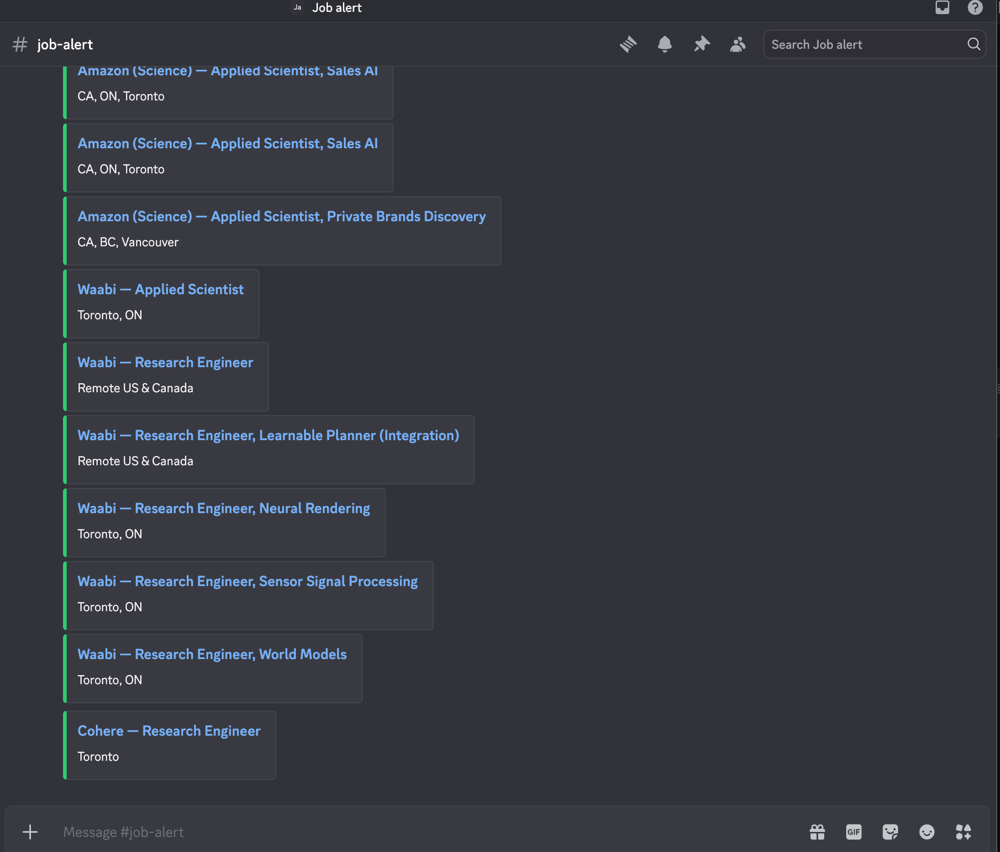

# job-monitor

A job notifier I built to filter openings the way I want and get a Discord ping
the moment something matches. It polls company career APIs on a schedule and only
sends postings that are new and match my keywords and locations. No third-party
dependencies; Python 3.8+ standard library only.



## Why

I got tired of refreshing a pile of careers pages, so I wanted a job notifier
that does the filtering for me. Most companies serve their open roles from a
public JSON API (the same one their careers page calls). This subscribes to
those feeds, keeps only the roles that match my filters, remembers what it has
already seen, and pings me on Discord when a new one shows up.

## Supported platforms

| Type        | Endpoint                                                      | Example companies                         |
|-------------|--------------------------------------------------------------|-------------------------------------------|
| `greenhouse`| `boards-api.greenhouse.io/v1/boards/<board>/jobs`            | Stripe, Datadog, Coinbase, Okta           |
| `lever`     | `api.lever.co/v0/postings/<company>`                         | Palantir, Waabi, Magnet Forensics         |
| `ashby`     | `api.ashbyhq.com/posting-api/job-board/<board>`             | OpenAI, Cohere, 1Password, Vanta          |
| `amazon`    | `amazon.jobs/en/search.json`                                 | Amazon                                    |
| `workday`   | `<host>/wday/cxs/<tenant>/<site>/jobs`                       | TD, CrowdStrike, Trend Micro, Arctic Wolf |
| `phenom`    | `<host>/widgets`                                             | RBC, eBay                                 |
| `eightfold` | `<host>/api/apply/v2/jobs`                                   | Netflix                                   |
| `recruitee` | `<board>.recruitee.com/api/offers/`                         | Huawei Canada                             |
| `google`    | Careers batchexecute RPC (`r06xKb`), JSON behind the results page | Google                               |
| `microsoft` | `apply.careers.microsoft.com/api/pcsx/search` (Eightfold)    | Microsoft                                 |
| `apple`     | `jobs.apple.com/api/v1/search`                               | Apple                                     |
| `shopify`   | Shopify Careers page (HTML scrape)                           | Shopify                                   |
| `github_listings` | `listings.json` from community new-grad list repos      | SimplifyJobs/New-Grad-Positions, vanshb03/New-Grad-2027 |
| `successfactors` | `<host>/services/rss/job/` (jobs2web RSS)               | SAP                                       |
| `icims`     | `<host>/api/jobs` (iCIMS Career Sites / Jibe)                | AMD                                       |
| `oracle`    | Oracle Recruiting Cloud `recruitingCEJobRequisitions` REST   | Fortinet, Uber                            |
| `pcsx`      | Eightfold `/api/pcsx/search`                                 | Ericsson                                  |
| `dayforce`  | `<region>.dayforcehcm.com/Api/<client>/V1/JobFeeds`          | eSentire                                  |
| `smartrecruiters` | `api.smartrecruiters.com/v1/companies/<X>/postings`    | ServiceNow                                |
| `jazzhr`    | `<board>.applytojob.com/apply` (HTML)                        | Xanadu                                    |
| `ibm`       | `www-api.ibm.com/search/api/v2` (Elasticsearch proxy)        | IBM                                       |

## Project layout

```
job_monitor/
├── run.py                     # entry point: python3 run.py
├── config.json                # sources, keywords, locations
├── pyproject.toml
├── jobmonitor/
│   ├── cli.py                 # argument parsing + orchestration
│   ├── fetchers.py            # one adapter per platform + FETCHERS registry
│   ├── filters.py             # title/location matching
│   ├── notify.py              # Discord / Slack webhooks
│   ├── state.py               # seen.json persistence
│   ├── http.py                # urllib helpers
│   └── models.py              # Job dataclass
├── tests/                     # unittest suite (offline, HTTP mocked)
└── .github/workflows/monitor.yml
```

## Usage

```bash
# Preview: fetch and print matches, send nothing, change nothing
python3 run.py --dry-run

# Live run. First run seeds state silently; later runs notify on new jobs only.
export DISCORD_WEBHOOK_URL="https://discord.com/api/webhooks/xxxx/yyyy"
python3 run.py

# Force notifications on the first run too
python3 run.py --notify-first
```

Create a Discord webhook via: channel settings, Integrations, Webhooks, New
Webhook, Copy URL. For Slack, create an Incoming Webhook and set
`SLACK_WEBHOOK_URL`. If both are set, both receive notifications.

## Configuration (`config.json`)

Three global fields plus a list of sources:

- `keywords`: case-insensitive substring match on the job title. A title matches
  if it contains any keyword.
- `exclude_keywords`: if the title contains any of these, the job is dropped even
  when a keyword matched.
- `locations`: a job is kept only if its location contains one of these terms. An
  empty list disables location filtering.
- `sources`: one entry per feed. Any source can override `keywords`,
  `exclude_keywords`, or `locations` just for itself.

## Customizing it for your own search

**Add a company.** Find which platform it uses by opening its careers page and
watching the network requests (F12). A request to
`boards.greenhouse.io/embed/job_board?for=<x>` means Greenhouse (board `<x>`),
`jobs.lever.co/<x>` means Lever, `<x>.myworkdayjobs.com` means Workday, and
`jobs.ashbyhq.com/<x>` means Ashby. Then add one entry to `sources`. For most
platforms it is a single line:

```json
{ "type": "greenhouse", "name": "Stripe", "board": "stripe" }
```

Workday needs a bit more (host, tenant, site), and you should give it a
`country` plus a client-side location filter:

```json
{
  "type": "workday",
  "name": "TD",
  "host": "td.wd3.myworkdayjobs.com",
  "tenant": "td",
  "site": "TD_Bank_Careers",
  "search": "software engineer",
  "country": "CAN",
  "pages": 3
}
```

**Change what counts as a match.** Edit `keywords` to describe the roles you
want (for example `"new grad"`, `"software engineer i,"`, `"security analyst"`)
and `exclude_keywords` to cut the noise (for example `"senior"`, `"staff"`,
`"manager"`, `"intern"`). Matching is on the title only.

**Change where.** Edit `locations` to the cities or countries you care about
(for example `"toronto"`, `"vancouver"`, `"canada"`). Leave it empty to allow
anywhere.

**Filter a single company differently.** Put `keywords` or `locations` inside a
source to override the global lists there. This is handy when one company uses
odd titles, for example a security-only search at Amazon:

```json
{
  "type": "amazon",
  "name": "Amazon Security",
  "query": "security engineer",
  "countries": ["CAN"],
  "keywords": ["security engineer i,", "new grad", "early career"]
}
```

**Subscribe to the GitHub new-grad lists.** The `github_listings` type reads the
structured `listings.json` that the community-maintained new-grad repos generate
their README tables from, so every posting the crowd tracks lands in the same
Discord channel as the company feeds. One source entry covers any number of
list repos; postings appearing in several lists are de-duplicated by apply URL,
listings marked as requiring U.S. citizenship are dropped at the source, and
`max_age_days` keeps the initial backfill sane:

```json
{
  "type": "github_listings",
  "name": "GitHub New-Grad Lists",
  "urls": [
    "https://raw.githubusercontent.com/SimplifyJobs/New-Grad-Positions/dev/.github/scripts/listings.json",
    "https://raw.githubusercontent.com/vanshb03/New-Grad-2027/main/.github/scripts/listings.json"
  ],
  "max_age_days": 30
}
```

Note the branch in each raw URL (Simplify uses `dev`, not `main`). If a list
starts returning 404, check whether the repo moved the file or renamed its
default branch.

**Big-tech direct sources.** Microsoft, Apple, and Google don't use a standard
ATS, so each has a dedicated fetcher (verified 2026-08). Quirks worth knowing
when they break:

- `microsoft` — Eightfold PCSX API, GET with `query`/`location` params. Page
  size is pinned to 10 (`num` below 10 is ignored). The pre-2026
  `gcsservices.careers.microsoft.com` endpoint is dead (stale TLS cert).
- `apple` — POST `api/v1/search`; the body must include the `sort` and
  `format` keys or the API silently returns zero results. Multi-location
  postings repeat per location; the fetcher dedupes on `positionId`.
- `google` — the careers page is a JS app; jobs come from a `batchexecute`
  RPC with a double-encoded `f.req` form field and a `)]}'` response prefix.
  The old `target_level=EARLY` server-side filter is defunct; entry-level
  filtering is client-side on titles like every other source.
- Workday tenants with custom facet GUIDs (e.g. NVIDIA's `locationHierarchy1`)
  can pass them via a raw `facets` object on the source entry.

Overlapping queries (e.g. "Microsoft" + "Microsoft (Security)") may return the
same posting; `collect_matches` dedupes globally on uid before notifying.

A good loop is: run `python3 run.py --dry-run`, look at how many jobs each source
returns and how many match, then tighten or loosen the keywords until the matches
are the ones you would actually apply to. Only then schedule it.

How to test if it is still running: `tail -3 /tmp/job_monitor.log`

## Tests

The suite uses the standard-library `unittest` and mocks the HTTP layer, so it
runs offline with no dependencies. Run it from the project root:

```bash
cd job_monitor          # the directory containing run.py and tests/
python3 -m unittest discover -s tests -v
```

It covers the title/location filters, the `seen.json` state round-trip, and each
platform's response parsing.

## Scheduling

**Local cron** (requires the machine to be awake):

```cron
*/15 * * * * DISCORD_WEBHOOK_URL="https://discord.com/api/webhooks/xxxx/yyyy" /usr/bin/python3 /path/to/job_monitor/run.py >> /tmp/job_monitor.log 2>&1
```

**GitHub Actions** (recommended, runs without your machine): push this repo to
your own GitHub repository, add `DISCORD_WEBHOOK_URL` as a repository secret, and
the included `.github/workflows/monitor.yml` runs every 15 minutes and commits
`seen.json` back to persist state.

## How state works

`seen.json` is a flat list of job identifiers. Ids are only ever added, so a
posting that disappears from a feed and later returns will not notify twice.
Delete `seen.json` to reset (the next run becomes a fresh first run).
